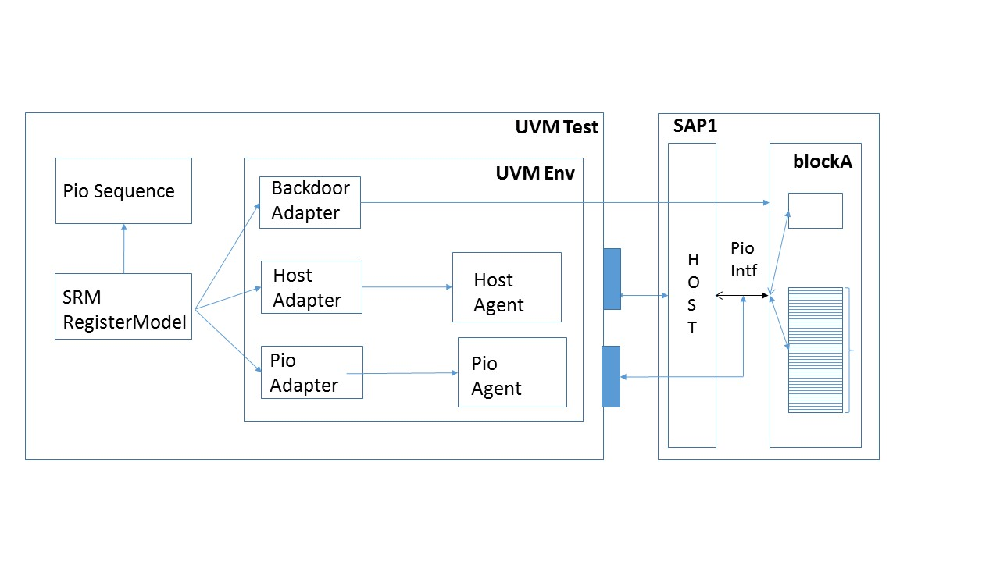

This directory contains "simple as possible" design that is verified using a uvm testbench.
In this example, the register model is modelled using simple_reg_model instead of "uvm_reg" package.

## FIXME
1. Merge search adapter into the base_handle class.  
2. How to implement policy. If backdoor is available then use it else fallback to frontdoor. The
frontdoor may be avaialalbe only on the root node.  
3. Provide default handles for these policies. like frontdoor, backdoor.  
4. Locking is not implemented. Not clear on the race conditions 

## Env Setup
The env assumes that you have 'vcs' and 'uvm' already available in your setup.
Download the srm package from *FIXME*
To run the testbench the following envrionment variable must be set.
*SRM_HOME* : Pointer to the install directory for srm package.
*SAP_HOME* : Pointer to this directory.

The Makefile uses these 2 environment variable to find all the source files.

A sample file 'my_setup.csh' in this directory sets up my environment.

## Design SAP1
The design is a chip called 'sap1' in dir *sap1/dut*. The address map of the chip is shown below.


The chip has 2 blocks 'host' and 'blockX'. The block blk_x contains a 32 bit read/write
register 'r1' and a table of 1024 entries called 't1'. The register map is auto generated using
a register generation tool and checked into *sap1/regmodel/sap1_srm_model.svh*.

Our goal is to verify that the read/write access to all these registers and tables are working.
For this a test *tests/sap1_srm_test.svh* is created.

## Testbench
The testbench is an uvm compliant testbench as shown below. It is checked into *sap1/env*


Accesses to the registers can be done through the host block. For optimizing simulation speed, it is also possible to access the memory
through 'sidedoor' or through 'backdoor'. Sidedoor access bypasses the host block and directly drives the signals on the block address decoder. Backdoor access uses hierarichal access to write/read the values in zero time.

## Running SAP1
The test *sap1_srm_test* issues writes and read to the register and the table. To run the sim

```
   cd run
   make run_vcs
```

## Design SAP2
The design sap2 consists of 2 instances of previous design sap1, sharing the host interface. The address map of the chip is shown below.

